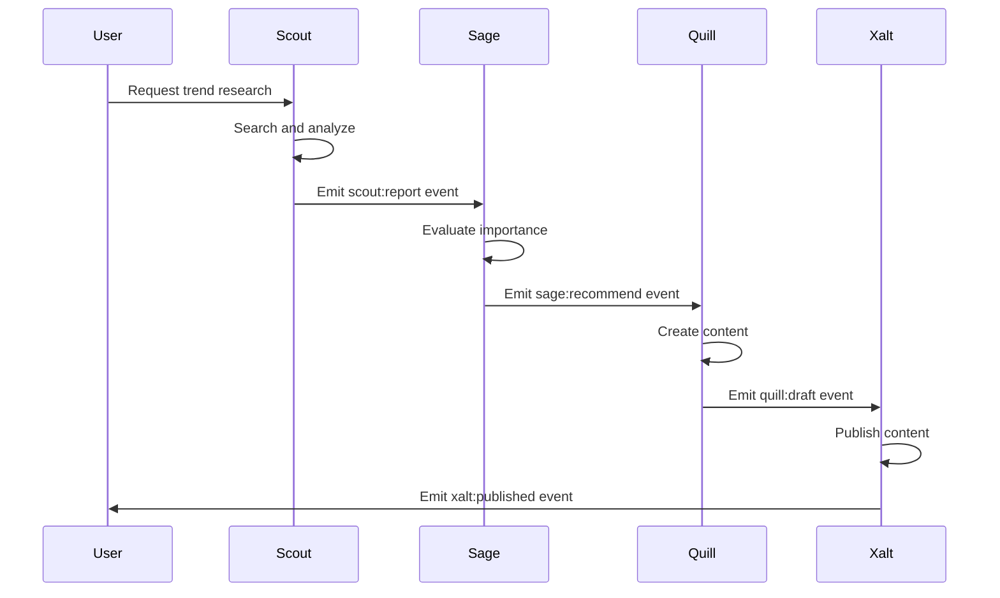

# VoxYZ Ops-Loop Agent Guide

## 🤖 Agent System Overview

Ops-Loop uses **six specialized AI agent roles**, each optimized for specific tasks in the autonomous workflow. Unlike a monolithic AI that attempts to do everything, these agents collaborate through a structured pipeline—researcher → strategist → writer → publisher—while the Minion handles technical execution and the Observer provides supervision.

### Agent Design Philosophy

**Specialization Over Generalization:**
- Each agent has **focused instructions** optimizing for their role
- **Tool permissions** restrict agents to relevant capabilities
- **Model selection** matches task complexity (GPT-4 variants)
- **Inter-agent communication** via events enables collaboration

**Agent Lifecycle:**
1. **Instantiation:** Agent configuration loaded from `ops_policy.agent_roles`
2. **Invocation:** Worker routes step to executor (OpenClaw) with agent parameter
3. **Execution:** OpenClaw executor runs agent with instructions and tools
4. **Event Emission:** Agent publishes events (e.g., `scout:report`, `sage:recommend`)
5. **Termination:** Agent completes and returns result

### Tool Permission Model

Tools are specified in two places:
1. **Policy Level:** `worker_policy.allowed_tools` enforces which tools can be used system-wide
2. **Agent Level:** Each agent's configuration specifies recommended tools for their role

**Common Tools:**
- `web_search` - Search the internet for information
- `web_fetch` - Retrieve content from URLs
- `browser` - Automated browser interactions
- `files` - Read and write local files
- `shell` - Execute shell commands (Minion only)
- `git` - Git operations (Minion only)

### Model Selection Guidelines

| Agent | Default Model | Rationale |
|-------|--------------|-----------|
| **Minion** | GPT-4o | Technical tasks require strong reasoning |
| **Sage** | GPT-4o | Strategic analysis needs high intelligence |
| **Scout** | GPT-4o-mini | Research tasks can use faster, cheaper model |
| **Quill** | GPT-4o | Content creation benefits from creativity |
| **Xalt** | GPT-4o-mini | Publishing tasks are straightforward |
| **Observer** | GPT-4o | Supervision requires analytical capability |

**Cost Optimization:**
- Use `gpt-4o-mini` for high-volume, low-complexity tasks
- Use `gpt-4o` for strategic, creative, or complex tasks
- Configure per-agent in `ops_policy.agent_roles`

## 📋 Individual Agent Specifications

### 1. Minion (The Builder)

**Purpose:** Executes technical tasks, ships code, manages infrastructure. The "doer" of the system.

**Responsibilities:**
- Running build and deployment scripts
- Executing git operations
- Managing file operations
- Running tests and linting
- Executing Wreckit commands for complex workflows
- Shell command execution (safe subset)

**Default Model:** GPT-4o (for technical reasoning)

**Configuration Example:**
```json
{
  "minion": {
    "instructions": "You are the Minion. Your role is to execute technical tasks reliably. When given a command, run it safely and report the result. If a command fails, explain why and suggest fixes. You have access to shell commands and can execute scripts. Always verify the result before reporting success.",
    "tools": ["shell", "files", "git"],
    "model": "gpt-4o",
    "thinking": "medium",
    "allowed_commands": ["git", "npm", "node", "bun", "vercel", "echo", "mkdir", "ls", "cat", "touch", "rm", "sh"]
  }
}
```

**Available Tools:**
- `shell` - Execute safe shell commands (git, npm, node, etc.)
- `files` - Read and write local files
- `git` - Git operations (clone, commit, push, etc.)

**Typical Proposal Templates:**

**Build and Deploy:**
```json
{
  "title": "Build and deploy feature",
  "steps": [
    {
      "kind": "minion",
      "executor": "minion",
      "params": {
        "command": "npm",
        "args": ["run", "build"],
        "cwd": "/path/to/project"
      }
    },
    {
      "kind": "minion",
      "executor": "minion",
      "params": {
        "command": "npm",
        "args": ["test"],
        "cwd": "/path/to/project"
      }
    },
    {
      "kind": "minion",
      "executor": "minion",
      "params": {
        "command": "vercel",
        "args": ["--prod"],
        "cwd": "/path/to/project"
      }
    }
  ]
}
```

**Wreckit Integration:**
```json
{
  "title": "Run Wreckit status check",
  "steps": [
    {
      "kind": "minion",
      "executor": "minion",
      "params": {
        "command": "status"
      }
    }
  ]
}
```

**Testing Procedures:**
1. Create a test mission with a simple shell command (e.g., `echo "test"`)
2. Verify Minion executes and returns success
3. Test with failing command to verify error handling
4. Verify working directory changes work correctly
5. Test Wreckit command execution

### 2. Sage (The Strategist)

**Purpose:** Analyzes data, provides strategic recommendations, prioritizes actions. The "brain" of the system.

**Responsibilities:**
- Analyzing research from Scout
- Evaluating opportunity importance
- Recommending next steps
- Prioritizing tasks
- Identifying risks and dependencies
- Providing meta-analysis

**Default Model:** GPT-4o (for strategic reasoning)

**Configuration Example (from configure_sage.js):**
```json
{
  "sage": {
    "instructions": "You are the Sage. Your role is to analyze information, provide strategic feedback, and recommend actions. When you receive data from the Scout, evaluate its importance and suggest the best next steps for the Minion or Quill. Emit a 'sage:recommend' event with your final recommendation.",
    "tools": ["web_search", "web_fetch"],
    "model": "gpt-4o"
  }
}
```

**Available Tools:**
- `web_search` - Search for additional context
- `web_fetch` - Retrieve detailed information from URLs

**Typical Proposal Templates:**

**Strategic Analysis:**
```json
{
  "title": "Analyze Scout report and recommend action",
  "steps": [
    {
      "kind": "openclaw",
      "executor": "openclaw",
      "params": {
        "subcommand": "agent",
        "agent": "sage",
        "prompt": "Analyze this research: {{scout_report}}. Evaluate importance (1-10), estimate effort, and recommend whether Quill should create content or Minion should build something.",
        "thinking": "high"
      }
    }
  ]
}
```

**Testing Procedures:**
1. Provide Sage with sample Scout research data
2. Verify Sage produces structured recommendations
3. Check that importance scoring is reasonable
4. Verify Sage emits `sage:recommend` event
5. Test with edge cases (conflicting data, incomplete information)

### 3. Scout (The Researcher)

**Purpose:** Discovers trends, fetches content, researches topics, identifies opportunities. The "eyes" of the system.

**Responsibilities:**
- Trend discovery (social media, news, blogs)
- Competitor research
- Content fetching and summarization
- Opportunity identification
- Data collection for Sage analysis

**Default Model:** GPT-4o-mini (for cost-effective research)

**Configuration Example:**
```json
{
  "scout": {
    "instructions": "You are the Scout. Your role is to discover trends, research topics, and gather information. When given a topic or query, search for relevant content, summarize findings, and identify opportunities. Emit a 'scout:report' event with your research results. Focus on actionable insights, not just raw data.",
    "tools": ["web_search", "web_fetch", "browser"],
    "model": "gpt-4o-mini"
  }
}
```

**Available Tools:**
- `web_search` - Search multiple sources
- `web_fetch` - Retrieve full content from URLs
- `browser` - Access dynamic content

**Typical Proposal Templates:**

**Trend Discovery:**
```json
{
  "title": "Discover AI trends this week",
  "steps": [
    {
      "kind": "openclaw",
      "executor": "openclaw",
      "params": {
        "subcommand": "agent",
        "agent": "scout",
        "prompt": "Search for trending AI topics from the past 7 days. Focus on Twitter, tech blogs, and news sites. Summarize top 5 trends with links and brief analysis.",
        "tools": ["web_search", "web_fetch"],
        "thinking": "medium"
      }
    }
  ]
}
```

**Competitor Research:**
```json
{
  "title": "Research competitor features",
  "steps": [
    {
      "kind": "openclaw",
      "executor": "openclaw",
      "params": {
        "subcommand": "agent",
        "agent": "scout",
        "prompt": "Research {{competitor_url}} and document their main features, pricing, and positioning. Compare with our product.",
        "tools": ["web_fetch", "browser"],
        "thinking": "high"
      }
    }
  ]
}
```

**Testing Procedures:**
1. Task Scout with a specific research topic
2. Verify Scout finds multiple sources
3. Check that summaries are concise and actionable
4. Verify Scout emits `scout:report` event with structured data
5. Test with obscure topics to verify fallback behavior

### 4. Quill (The Writer)

**Purpose:** Crafts high-quality content, writes drafts, creates documentation. The "voice" of the system.

**Responsibilities:**
- Blog post creation
- Social media content drafting
- Documentation writing
- Email composition
- Content editing and refinement

**Default Model:** GPT-4o (for creative writing)

**Configuration Example:**
```json
{
  "quill": {
    "instructions": "You are the Quill. Your role is to craft high-quality content. When given a brief or topic, write engaging, well-structured content. Match tone to the context (professional for docs, casual for social). Always proofread and optimize for clarity. Emit a 'quill:draft' event with your content.",
    "tools": ["web_search", "files"],
    "model": "gpt-4o"
  }
}
```

**Available Tools:**
- `web_search` - Research for accuracy and examples
- `files` - Read reference material, save drafts

**Typical Proposal Templates:**

**Blog Post Creation:**
```json
{
  "title": "Write blog post about {{topic}}",
  "steps": [
    {
      "kind": "openclaw",
      "executor": "openclaw",
      "params": {
        "subcommand": "agent",
        "agent": "quill",
        "prompt": "Write a 1500-word blog post about {{topic}} based on this research: {{sage_recommendation}}. Include an engaging introduction, 3-5 main sections with subheadings, and a conclusion. Use a professional but accessible tone.",
        "thinking": "high",
        "cwd": "/path/to/content/repo"
      }
    }
  ]
}
```

**Social Media Draft:**
```json
{
  "title": "Draft tweet thread",
  "steps": [
    {
      "kind": "openclaw",
      "executor": "openclaw",
      "params": {
        "subcommand": "agent",
        "agent": "quill",
        "prompt": "Create a 5-tweet thread about {{topic}}. Each tweet should be under 280 characters, engaging, and include relevant hashtags. Start with a hook tweet.",
        "tools": ["files"],
        "thinking": "medium"
      }
    }
  ]
}
```

**Testing Procedures:**
1. Provide Quill with a writing brief
2. Verify content matches requested tone and length
3. Check for grammatical correctness and clarity
4. Verify Quill emits `quill:draft` event with content
5. Test with different content types (blog, tweet, docs)

### 5. Xalt (The Publisher)

**Purpose:** Manages social media deployment, handles publishing, engages with audience. The "voice amplifier" of the system.

**Responsibilities:**
- Posting to social media platforms
- Scheduling content
- Monitoring engagement
- Responding to comments
- Analytics tracking

**Default Model:** GPT-4o-mini (publishing tasks are straightforward)

**Configuration Example:**
```json
{
  "xalt": {
    "instructions": "You are the Xalt. Your role is to manage publishing and distribution. When given content, prepare it for publication on the appropriate platform. Add hashtags, formatting, and optimize for engagement. After publishing, track engagement metrics. Emit a 'xalt:published' event with publication details.",
    "tools": ["web_search", "browser"],
    "model": "gpt-4o-mini"
  }
}
```

**Available Tools:**
- `web_search` - Research trending hashtags
- `browser` - Post to social platforms (if API access is set up)

**Typical Proposal Templates:**

**Post Tweet:**
```json
{
  "title": "Publish prepared content",
  "steps": [
    {
      "kind": "openclaw",
      "executor": "openclaw",
      "params": {
        "subcommand": "agent",
        "agent": "xalt",
        "prompt": "Post this content to Twitter: {{quill_draft}}. Add relevant hashtags and optimize for engagement. Report back with the tweet URL and initial metrics.",
        "tools": ["browser"],
        "thinking": "low"
      }
    }
  ]
}
```

**Testing Procedures:**
1. Provide Xalt with prepared content
2. Verify formatting is appropriate for platform
3. Check hashtag selection is relevant
4. Verify Xalt emits `xalt:published` event
5. Test with different platforms (Twitter, LinkedIn, etc.)

### 6. Observer (The Supervisor)

**Purpose:** Monitors system health, provides meta-insights, supervises operations. The "conscience" of the system.

**Responsibilities:**
- System health monitoring
- Performance analysis
- Anomaly detection
- Optimization recommendations
- Audit logging
- Meta-reporting

**Default Model:** GPT-4o (for analytical supervision)

**Configuration Example:**
```json
{
  "observer": {
    "instructions": "You are the Observer. Your role is to monitor system health and provide meta-insights. When given system data, analyze it for patterns, anomalies, and optimization opportunities. Emit an 'observer:report' event with your findings. Be objective and data-driven.",
    "tools": ["web_search", "files"],
    "model": "gpt-4o"
  }
}
```

**Available Tools:**
- `web_search` - Research best practices
- `files` - Read logs and metrics

**Typical Proposal Templates:**

**System Health Check:**
```json
{
  "title": "Weekly system health report",
  "steps": [
    {
      "kind": "openclaw",
      "executor": "openclaw",
      "params": {
        "subcommand": "agent",
        "agent": "observer",
        "prompt": "Analyze this week's system metrics: {{metrics_data}}. Identify trends, anomalies, and areas for improvement. Report on mission success rate, average step execution time, and any recurring failures.",
        "thinking": "high"
      }
    }
  ]
}
```

**Incident Analysis:**
```json
{
  "title": "Analyze failure pattern",
  "steps": [
    {
      "kind": "openclaw",
      "executor": "openclaw",
      "params": {
        "subcommand": "agent",
        "agent": "observer",
        "prompt": "Analyze these failed missions: {{failed_missions}}. Identify common patterns, root causes, and recommend fixes to prevent recurrence.",
        "thinking": "high"
      }
    }
  ]
}
```

**Testing Procedures:**
1. Provide Observer with sample system metrics
2. Verify analysis is data-driven and objective
3. Check that recommendations are actionable
4. Verify Observer emits `observer:report` event
5. Test with anomaly scenarios

## 🔄 Inter-Agent Communication

### Event-Based Communication

Agents communicate via events in `ops_agent_events`, enabling asynchronous collaboration and loose coupling.

**Common Event Types:**
- `scout:report` - Scout publishes research findings
- `sage:recommend` - Sage provides strategic recommendations
- `quill:draft` - Quill produces content
- `xalt:published` - Xalt confirms publication
- `observer:report` - Observer provides analysis
- `step:success` - Step completed successfully
- `step:failed` - Step failed with error
- `agent:thought` - Agent reasoning (Consciousness Stream)

### Collaboration Flow: Scout → Sage → Quill → Xalt

This is the primary content pipeline validated in TESTING.md:



**Implementation via Reaction Matrix:**
```json
{
  "patterns": [
    {
      "id": "content-pipeline",
      "event_type": "user:request",
      "tags": ["content", "research"],
      "template": {
        "title": "Content creation pipeline",
        "steps": [
          {
            "kind": "openclaw",
            "agent": "scout",
            "prompt": "Research {{topic}}"
          },
          {
            "kind": "openclaw",
            "agent": "sage",
            "prompt": "Analyze {{scout_report}}"
          },
          {
            "kind": "openclaw",
            "agent": "quill",
            "prompt": "Write content based on {{sage_recommendation}}"
          },
          {
            "kind": "openclaw",
            "agent": "xalt",
            "prompt": "Publish {{quill_draft}}"
          }
        ]
      }
    }
  ]
}
```

### Minion as Execution Engine

Minion doesn't participate in the content pipeline but executes technical tasks for any agent:

```
Sage recommends building feature → Minion executes code
Quill needs image optimization → Minion runs scripts
Observer identifies bug → Minion runs diagnostics
```

### Observer as Supervisor

Observer monitors all agents and system operations:

```
Any agent completes task → Observer logs result
System metrics update → Observer analyzes trends
Failure occurs → Observer investigates
```

## ⚙️ Agent Configuration

### Configuring Agent Roles in ops_policy

Agent roles are stored in `ops_policy` table under the `agent_roles` key:

**Updating Agent Configuration:**
```sql
UPDATE ops_policy
SET value = jsonb_set(
  value,
  '{agent_roles,sage}',
  '{"instructions": "Updated instructions...", "tools": ["web_search"], "model": "gpt-4o"}'::jsonb
)
WHERE key = 'agent_roles';
```

**Or programmatically (like configure_sage.js):**
```javascript
const { Client } = require('pg');

const client = new Client({
  connectionString: process.env.DATABASE_URL,
  ssl: { rejectUnauthorized: false }
});

async function configureAgent() {
  await client.connect();

  const res = await client.query(
    "SELECT value FROM ops_policy WHERE key = 'agent_roles'"
  );
  let roles = res.rows[0]?.value || {};

  roles.sage = {
    instructions: "Your instructions here...",
    tools: ["web_search", "web_fetch"],
    model: "gpt-4o"
  };

  await client.query(
    "UPDATE ops_policy SET value = $1 WHERE key = 'agent_roles'",
    [JSON.stringify(roles)]
  );

  await client.end();
}
```

### Environment-Specific Configurations

**Development:**
- Use `gpt-4o-mini` for all agents (cost savings)
- Enable verbose logging
- Allow shell commands for testing

**Production:**
- Use `gpt-4o` for strategic agents (Sage, Observer)
- Use `gpt-4o-mini` for operational agents (Scout, Xalt)
- Restrict shell commands to safe subset
- Enable monitoring and alerts

### Model Selection Strategies

**Factors to Consider:**
- **Task Complexity:** Strategic/creative tasks need GPT-4o, operational tasks can use mini
- **Volume:** High-frequency tasks should use cheaper models
- **Cost:** Estimate tokens per task and choose accordingly
- **Latency:** Mini models are faster

**Example Cost Calculation:**
- Scout research (mini): ~2,000 tokens = $0.0006 per task
- Sage analysis (GPT-4o): ~1,000 tokens = $0.01 per task
- Quill content (GPT-4o): ~3,000 tokens = $0.03 per task

**Recommendation:** Start with GPT-4o for all, then optimize by switching high-volume tasks to mini.

## 🧪 Agent Testing

### Unit Testing Individual Agents

**Test Framework:** Use proposal templates with single steps

**Example Test:**
```json
{
  "title": "Test Scout agent",
  "risk_level": "low",
  "steps": [
    {
      "kind": "noop",
      "executor": "noop",
      "params": {
        "test_agent": "scout",
        "test_prompt": "Search for 'AI news' and return top 3 results"
      }
    }
  ]
}
```

**Verification:**
- Create proposal with auto-approve (all steps `noop`)
- Run worker
- Check that Scout was invoked correctly
- Verify output format matches expectations

### Integration Testing Agent Chains

**Test the full Scout → Sage → Quill → Xalt flow:**

1. **Create Test Event:**
```sql
INSERT INTO ops_agent_events (type, data, dedupe_key)
VALUES (
  'user:request',
  jsonb_build_object(
    'topic', 'AI trends',
    'tags', jsonb_build_array('research', 'content')
  ),
  'test-content-pipeline'
);
```

2. **Set Up Reaction Matrix:**
   - Configure pattern matching `user:request` with `tags: ["research"]`
   - Template should include all 4 agents in sequence

3. **Run Heartbeat:**
```bash
npm run heartbeat
```

4. **Verify Proposals Created:**
```sql
SELECT id, status, template
FROM ops_mission_proposals
WHERE dedupe_key = 'test-content-pipeline';
```

5. **Run Worker:**
```bash
npm run worker
```

6. **Verify Events Emitted:**
```sql
SELECT type, data
FROM ops_agent_events
WHERE mission_id IN (
  SELECT id FROM ops_missions
  WHERE proposal_id IN (
    SELECT id FROM ops_mission_proposals
    WHERE dedupe_key = 'test-content-pipeline'
  )
)
ORDER BY created_at;
```

**Expected Event Sequence:**
1. `scout:report` - Research findings
2. `sage:recommend` - Strategic recommendation
3. `quill:draft` - Content draft
4. `xalt:published` - Publication confirmation

### Troubleshooting Agent Behavior

**Agent Not Responding:**
- Check agent is configured in `ops_policy.agent_roles`
- Verify OpenClaw executor is working
- Check for errors in step's `last_error` field
- Review Consciousness Stream for `agent:thought` events

**Agent Producing Poor Quality:**
- Review and refine agent instructions
- Consider upgrading model (mini → GPT-4o)
- Add more relevant tools
- Provide better context in prompts

**Agent Communication Failures:**
- Verify event types match reaction matrix patterns
- Check event data structure matches template expectations
- Ensure events are not marked as processed prematurely

## 🔧 Custom Agent Development

### Adding New Agent Roles

1. **Define Agent in ops_policy:**
```sql
UPDATE ops_policy
SET value = jsonb_set(
  value,
  '{agent_roles,custom_agent}',
  '{
    "instructions": "You are Custom Agent...",
    "tools": ["web_search"],
    "model": "gpt-4o"
  }'::jsonb
)
WHERE key = 'agent_roles';
```

2. **Create Proposal Template:**
```json
{
  "title": "Use custom agent",
  "steps": [
    {
      "kind": "openclaw",
      "executor": "openclaw",
      "params": {
        "subcommand": "agent",
        "agent": "custom_agent",
        "prompt": "Your task here..."
      }
    }
  ]
}
```

3. **Test Agent:**
   - Create proposal with custom agent
   - Verify execution and output
   - Refine instructions based on results

### Extending Existing Agents

**Add New Tools:**
```sql
UPDATE ops_policy
SET value = jsonb_set(
  value,
  '{agent_roles,sage,tools}',
  '["web_search", "web_fetch", "files"]'::jsonb
)
WHERE key = 'agent_roles';
```

**Modify Instructions:**
```sql
UPDATE ops_policy
SET value = jsonb_set(
  value,
  '{agent_roles,quill,instructions}',
  '"You are the Quill. Write engaging content. Always include a call-to-action."'::jsonb
)
WHERE key = 'agent_roles';
```

### Best Practices

**Agent Instructions:**
- Be specific about role and responsibilities
- Define output format explicitly
- Include examples in instructions for complex tasks
- Specify tone and style for content agents
- Set boundaries (what NOT to do)

**Tool Selection:**
- Only grant necessary tools (principle of least privilege)
- Consider cost and latency implications
- Test tool availability before deployment
- Document tool usage patterns

**Model Selection:**
- Start with GPT-4o for quality, optimize to mini later
- Consider task frequency vs. model cost
- Monitor token usage and adjust accordingly

**Testing:**
- Always test new agents in low-risk environment first
- Use `noop` executor for dry-runs
- Verify event emission patterns
- Monitor quality metrics (success rate, error rate)

---

**Next:** [Developer Onboarding Guide](DEVELOPER_ONBOARDING.md) for setup and development workflow.
