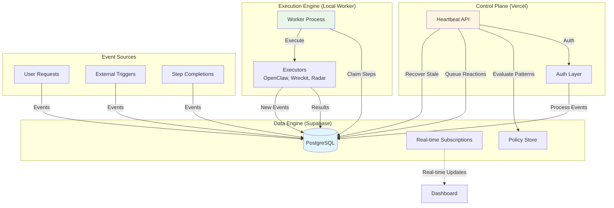

# VoxYZ Ops-Loop System Overview

## 📋 Executive Summary

The VoxYZ Ops-Loop is an **autonomous multi-agent system** that transforms static task management into dynamic, event-driven operations. Built on a closed-loop architecture combining **Vercel** (control plane), **Supabase** (data engine with PostgreSQL + real-time), and a **Local Worker** (execution engine), the system enables intelligent task execution with human oversight.

Unlike traditional cron jobs or manual workflows, Ops-Loop uses **six specialized AI agents**—Minion, Sage, Scout, Quill, Xalt, and Observer—that collaborate through a structured pipeline: Events → Reactions → Proposals → Missions → Execution. Each agent has a distinct role, from discovering opportunities (Scout) to analyzing strategy (Sage) to publishing content (Xalt).

The system's core innovation lies in its **policy-based governance**: all proposals pass through configurable gates that enforce caps, require approvals, or enable auto-approval for low-risk tasks. This balance between autonomy and oversight makes Ops-Loop ideal for content pipelines, research automation, code deployment, and monitoring operations.

## 🎯 Business Problem

**The Challenge:** Modern workflows require constant attention—monitoring signals, analyzing opportunities, creating content, deploying code, and engaging with audiences. Manual execution is slow and error-prone, while full automation risks uncontrolled actions.

**The Solution:** Ops-Loop provides **supervised autonomy**. The system processes events continuously, generates strategic proposals, and executes approved tasks—all while enforcing policy boundaries and maintaining human control through approval gates.

**Key Benefits:**
- **Continuous Operation:** Events processed every 5 minutes, tasks executed every minute
- **Strategic Intelligence:** Agents collaborate across roles (researcher → strategist → writer → publisher)
- **Risk Control:** Policy-based caps, auto-approval rules, and manual gates
- **Observability:** Real-time "Consciousness Stream" shows system reasoning
- **Dead Letter Handling:** Failed steps preserved for inspection, not dropped

## 🏗️ Architecture at a Glance



**Three-Tier Architecture:**

1. **Control Plane (Vercel)**: Lightweight Next.js API routes that process events, evaluate reaction patterns, and maintain system health. No heavy computation—just orchestration.

2. **Data Engine (Supabase)**: PostgreSQL database with real-time capabilities. Stores events, reactions, proposals, missions, and steps. Provides policy storage and RPC functions for proposal gating and auto-approval.

3. **Execution Engine (Local Worker)**: Background process claiming and executing mission steps. Routes tasks to specialized executors (OpenClaw for AI agents, Wreckit for code operations, Radar for demand tracking).

## 🤖 Agent Philosophy

**Why 6 Specialized Roles Instead of 1 General AI?**

Just as effective teams have specialized roles, Ops-Loop agents excel through focused expertise:

| Agent | Role | Expertise | Output |
|-------|------|-----------|--------|
| **Minion** | The Builder | Code execution, file operations, technical tasks | Completed features, deployed code |
| **Sage** | The Strategist | Analysis, prioritization, recommendation | Strategic guidance, action recommendations |
| **Scout** | The Researcher | Trend discovery, content research, opportunity identification | Research reports, opportunity pitches |
| **Quill** | The Writer | Content creation, drafting, documentation | Blog posts, tweets, documentation |
| **Xalt** | The Publisher | Social media, audience engagement, distribution | Published content, engagement metrics |
| **Observer** | The Supervisor | System monitoring, health checks, meta-analysis | System health reports, optimization suggestions |

**Collaboration Flow:**
```
Scout discovers → Sage analyzes → Quill drafts → Xalt publishes
                  ↓
              Minion executes technical tasks
                  ↑
              Observer supervises all
```

This specialization enables:
- **Deeper expertise**: Each agent has optimized instructions and tools
- **Clear accountability**: Easy to trace which agent produced what
- **Parallel execution**: Multiple agents work on different aspects simultaneously
- **Composability**: Agents can be combined in custom workflows

## 🔄 Comparison with Alternatives

| Feature | **Ops-Loop** | **Cron Jobs** | **Manual Execution** | **Full Automation** |
|---------|-------------|---------------|---------------------|---------------------|
| **Event-Driven** | ✅ Yes (events trigger actions) | ❌ No (time-based only) | ❌ No (human-triggered) | ⚠️ Variable |
| **AI Collaboration** | ✅ 6 specialized agents | ❌ None | ❌ None | ⚠️ Single AI usually |
| **Policy Gates** | ✅ Configurable caps, approvals | ❌ None | ✅ Human oversight | ❌ None |
| **Observability** | ✅ Consciousness Stream | ❌ Logs only | ✅ Human knows | ⚠️ Variable |
| **Dead Letter Handling** | ✅ Failed steps preserved | ❌ Jobs fail silently | ✅ Human sees failures | ⚠️ Variable |
| **Real-time Monitoring** | ✅ Supabase real-time | ❌ No | ⚠️ Manual checks | ⚠️ Variable |
| **Scalability** | ✅ Horizontal (workers) | ⚠️ Process limits | ❌ Human limits | ✅ Potentially unlimited |
| **Risk Control** | ✅ Multi-layer (caps + approvals) | ❌ None | ✅ Human control | ❌ No safeguards |
| **Maintenance Overhead** | 🟡 Medium (policy tuning) | 🟢 Low | 🔴 High (manual work) | 🟢 Low (but risky) |

**When to Choose Ops-Loop:**
- Content pipelines requiring research → writing → publishing flows
- Research automation with opportunity discovery
- Code deployment with approval workflows
- Monitoring and incident response systems
- Any workflow needing **supervised autonomy**

**When to Use Alternatives:**
- Simple periodic tasks without decision-making (use cron)
- One-off manual operations (do it manually)
- Fully trusted, low-risk operations (full automation may suffice)

## 📚 Use Case Categories

### 1. Content Pipeline Automation
**Flow:** Scout discovers trending topics → Sage prioritizes → Quill drafts → Xalt publishes

**Example:**
```json
{
  "title": "Trend-based content creation",
  "steps": [
    { "kind": "research", "agent": "scout", "params": { "topic": "AI trends" } },
    { "kind": "analyze", "agent": "sage", "params": { "source": "scout_output" } },
    { "kind": "draft", "agent": "quill", "params": { "brief": "sage_recommendation" } },
    { "kind": "publish", "agent": "xalt", "params": { "content": "quill_draft" } }
  ]
}
```

### 2. Research Automation
**Flow:** Scout fetches data → Sage analyzes → Observer reports findings

**Example:**
```json
{
  "title": "Competitor analysis",
  "steps": [
    { "kind": "fetch", "agent": "scout", "params": { "urls": ["comp1.com", "comp2.com"] } },
    { "kind": "analyze", "agent": "sage", "params": { "focus": "pricing" } },
    { "kind": "report", "agent": "observer", "params": { "format": "summary" } }
  ]
}
```

### 3. Code Deployment with Approval
**Flow:** Minion prepares deployment → Human approves → Minion deploys → Observer verifies

**Example:**
```json
{
  "title": "Deploy feature to staging",
  "risk_level": "medium",
  "steps": [
    { "kind": "build", "executor": "wreckit", "params": { "command": "npm run build" } },
    { "kind": "test", "executor": "wreckit", "params": { "command": "npm test" } },
    { "kind": "deploy", "executor": "wreckit", "params": { "command": "npm run deploy:staging" } }
  ]
}
```

### 4. Monitoring and Incident Response
**Flow:** Events trigger alerts → Sage analyzes → Minion executes fixes → Observer reports

**Example:**
```json
{
  "title": "Respond to API latency spike",
  "steps": [
    { "kind": "analyze", "agent": "sage", "params": { "metric": "latency", "threshold": "1000ms" } },
    { "kind": "restart", "executor": "wreckit", "params": { "service": "api" } },
    { "kind": "verify", "agent": "observer", "params": { "metric": "latency" } }
  ]
}
```

## 🚀 Quick Start Navigation

**New to Ops-Loop? Start here:**
1. **[System Overview](docs/SYSTEM_OVERVIEW.md)** ← You are here
2. **[Architecture Deep Dive](docs/ARCHITECTURE_DEEP_DIVE.md)** - Technical details
3. **[Developer Onboarding](docs/DEVELOPER_ONBOARDING.md)** - Setup guide

**For Developers:**
1. **[Agent Guide](docs/AGENT_GUIDE.md)** - Agent configurations
2. **[Integration Guides](docs/INTEGRATION_GUIDES.md)** - Executors
3. **[API Reference](docs/API_REFERENCE.md)** - Function signatures

**For Operators:**
1. **[Policy Configuration](docs/POLICY_CONFIGURATION.md)** - Set up governance
2. **[Operations Runbook](docs/OPERATIONS_RUNBOOK.md)** - Deploy and monitor

**For Stakeholders:**
1. **[Architecture Deep Dive](docs/ARCHITECTURE_DEEP_DIVE.md)** - Understand the system
2. **[Agent Guide](docs/AGENT_GUIDE.md)** - Meet the agents

## 📖 Terminology

| Term | Definition |
|------|------------|
| **Event** | Raw signal entering the system (user request, step completion, external trigger). Stored in `ops_agent_events`. |
| **Reaction** | Pattern match between an event and a configured trigger, producing a proposal template. Stored in `ops_agent_reactions`. |
| **Proposal** | Gated intent requiring approval. Contains mission template (steps, risk level). Stored in `ops_mission_proposals`. |
| **Mission** | Approved proposal with sequential steps to execute. Stored in `ops_missions`. |
| **Step** | Individual unit of work within a mission. Has a kind (e.g., `draft_tweet`), executor, and parameters. Stored in `ops_mission_steps`. |
| **Executor** | Handler that executes steps (OpenClaw, Wreckit, Radar, Minion, Noop). Implemented in `local/src/executors/`. |
| **Agent** | AI role with specific instructions, tools, and model (Minion, Sage, Scout, Quill, Xalt, Observer). |
| **Policy** | Governance rule stored in `ops_policy` table (reaction_matrix, auto_approve, proposal_caps, worker_policy, agent_roles). |
| **Heartbeat** | Vercel API route (`/api/ops/heartbeat`) that processes events, evaluates triggers, and recovers stale steps. |
| **Worker** | Local process that claims and executes mission steps. Runs continuously via cron. |
| **Lease** | Time reservation for a step being executed. Expires after `OPS_STEP_LEASE_MINUTES`. |
| **Dead Letter** | Permanently failed step stored in `ops_step_dead_letters` for manual inspection. |
| **Consciousness Stream** | Real-time feed of agent thoughts and system reasoning via `agent:thought` events. |
| **Demand Radar** | 4-stage lifecycle board (Watching → Validating → Building → Shipped) for product ideas. |
| **Reaction Matrix** | Policy defining pattern matching rules for event → proposal triggers. |
| **Auto-Approval** | Policy allowing low-risk proposals to skip manual approval and auto-create missions. |
| **Proposal Caps** | Policy enforcing limits on proposal creation (e.g., daily maximum). |

---

**Next:** [Architecture Deep Dive](ARCHITECTURE_DEEP_DIVE.md) for technical details on components, data flows, and database schema.
